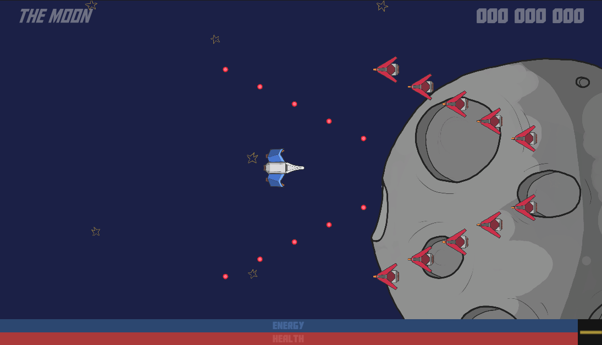

# Shoot them Up!

This project is a partial implementation of a shoot them up game used for academic purpose.
It uses Unity Engine and show an example of how to implement game mechanics using Vanilla Unity logic.

The repository contains three versions of the project:

- _tp-factory_: The project instantiate each elements one by one. This is the starter project to try implementing instance recycling using the factory design pattern.

- _ty-datadriven_: The project contains an implementation of the instance recycling but enemy are randomly generated. This is the starter project to try implementing a data-driven level design system.

- _main_: The main branch contains the full project with a solution to both exercises.

## Controls

Use the **arrow keys** to control the space ship, hit **space** to fire and **tabulation** to change the bullet type.

Tools to display debug informations are available when hitting **F1**.
